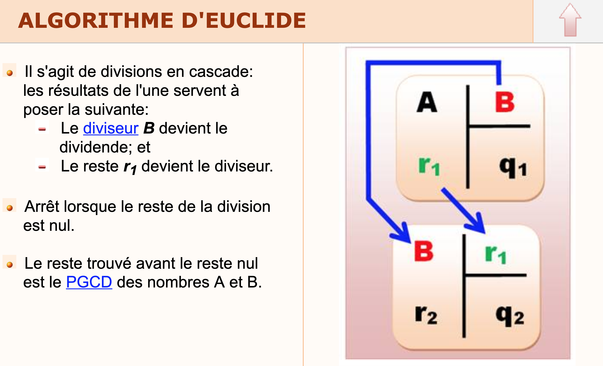

# Dojo PGCD
Rechercher le PGCD (plus grand commun diviseur) de deux
nombres donnés. Gérer au moyen d’une exception le cas où au
moins un des nombres n’est pas entier. Si vous avez le temps, faite moi un test unitaire

## Aide
* [Algorithme d'Euclide](https://fr.wikipedia.org/wiki/Algorithme_d%27Euclide)

### Exemple
